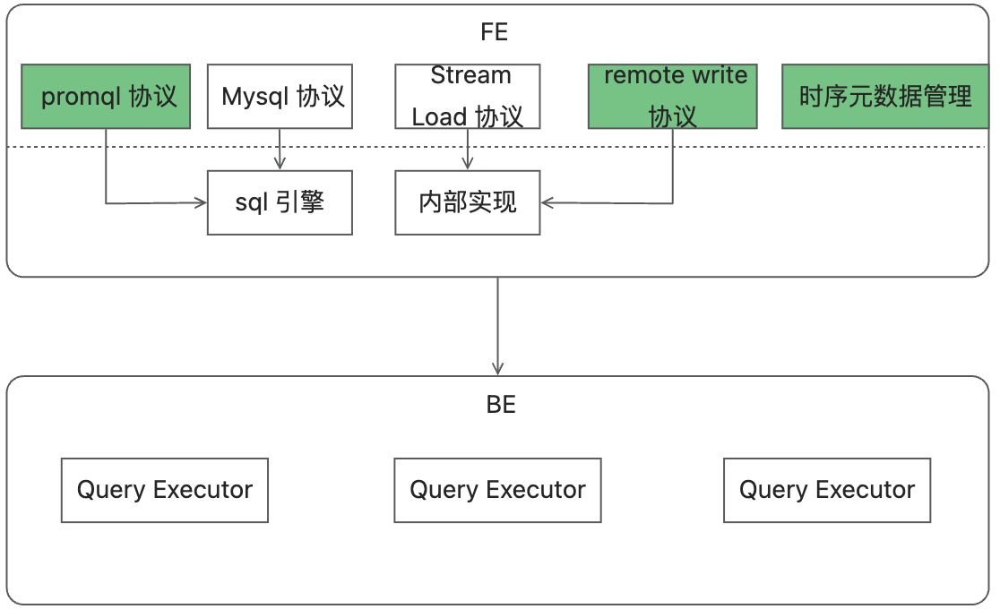

# 背景
1. 虽然promql目前已经成为了可观测领域的时序数据查询的事实标准，但是目前的prometheus在时序数据的处理上显得过于简单，很多高阶功能无法实现。同时缺乏自己独有的列式存储，也不具备MPP数据库的能力；
2. 作为可观测性的三类数据——时序，日志和trace。trace数据先不谈，时序数据和日志数据往往都是一个个信息孤岛，比如prometheus可以承载时序数据，doris可以用来存放日志数据，即使是vm这种既实现了时序数据，也实现了日志数据的方案，它内部的时序数据和日志数据彼此之间也是不通的。时序，日志和trace之间的联合分析是有很大的应用潜力的，可以通过时序和日志数据进行关联分析，可以发现很多系统隐患和异常。


# 方案
Apache Doris是一款基于MPP架构的高性能，实时分析型数据库。它以高效、简单和统一的特性著称，能够在亚秒级的时间内返回海量数据的查询结果。Doris 既能支持高并发的点查询场景，也能支持高吞吐的复杂分析场景。


Doris本身是支持日志存储和查看的，有着相对于ES 5倍以上的性能提升，那么能不能基于Doris来实现一套基于promql的时序数据库实现呢，答案是肯定的。




首先，doris的内部分为FE和BE的实现，FE是偏上层的应用，主要负责元数据管理，查询优化，集群调度等功能的实现，其系统也是由java编写的，相对于BE这种由C++实现的后台应用来说，进行二次开发的难度要小很多，同时这次也只是需要改动FE即可，BE是不需要动的。


## 时序元数据管理
假设有下面这么一个时序指标network，host，region和user是三个它的labels，iops和throughput分别是指标的值，这里我们需要支持多值，虽然prometheus不支持多值，但是vm和其他很多的时序库都是支持多值的，多值可以很好的减小存储成本和查询效率。


对于上面这个指标，我们在内部需要创建两张表与其对应。

```sql
CREATE TABLE IF NOT EXISTS network_meta
(
    user       			VARCHAR(1024), 
    host       			VARCHAR(1024),
    region       		VARCHAR(1024),
    id           		BIGINT NOT NULL AUTO_INCREMENT,
    INDEX idx_host(host) USING INVERTED,
    INDEX idx_region(region) USING INVERTED,
)
DUPLICATE KEY(host, region, user)
DISTRIBUTED BY HASH(user) BUCKETS 10
PROPERTIES{
"bloom_filter_columns"="user"
}

CREATE TABLE IF NOT EXISTS network_data
(
    ts        		 DATETIME       NOT NULL,
    meta_id        BIGINT         NOT NULL,
    iops      		 DOUBLE,
    throughput 		 DOUBLE
)
DUPLICATE KEY(ts, meta_id)
PARTITION BY RANGE(ts) ()
DISTRIBUTED BY HASH(meta_id)
PROPERTIES (
    "dynamic_partition.enable" = "true",
    "dynamic_partition.time_unit" = "HOUR",
    "dynamic_partition.start" = "-240",
    "dynamic_partition.end" = "0",
    "dynamic_partition.prefix" = "p",
    "dynamic_partition.buckets" = "8"
);

```

从上面的例子可以看到，系统会为每个指标名创建meta和data两张表，meta是元数据表，如果label都是低基数据的话，这张表一般不会太大，所以这张表默认也不需要分区。

data表存放的是真正时序数据的地方，meta_id对应着meta表的id，data表的ts, meta_id唯一的确定了一个时序点。

举个例子，对于promql来说，network{region="hangzhou", host="xxxx"} 来说，系统首先转化为如下的sql，查询对应的元数据

```sql
select id from network_meta where region = "hangzhou" and host = "xxxx"
```


然后根据查询得到的元数据id查询

```sql
select iops, throughput from network_data where id = "$id" and ts < "$ts" 
#取决于promql附带的时间参数
```


## Promql协议转换
TODO


## Remote Write协议转换
TODO


